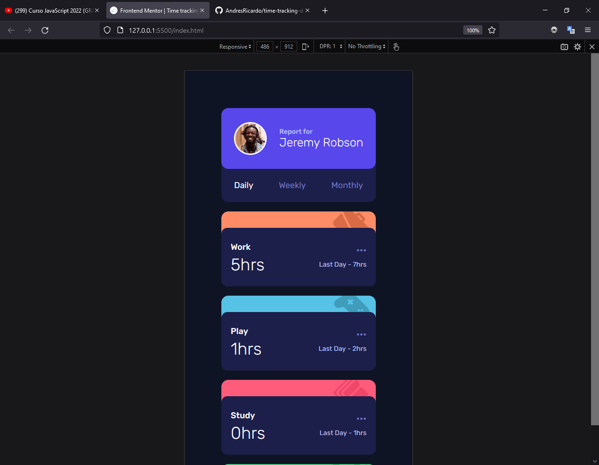
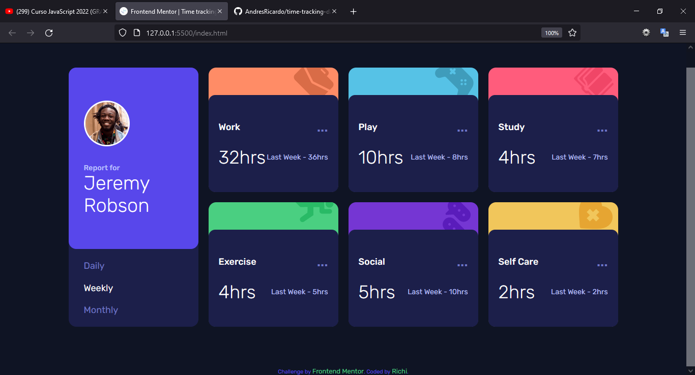

# Frontend Mentor - Time tracking dashboard solution

This is a solution to the [Time tracking dashboard challenge on Frontend Mentor](https://www.frontendmentor.io/challenges/time-tracking-dashboard-UIQ7167Jw). Frontend Mentor challenges help you improve your coding skills by building realistic projects.

## Table of contents

-   [Overview](#overview)
    -   [The challenge](#the-challenge)
    -   [Screenshot](#screenshot)
    -   [Links](#links)
-   [My process](#my-process)
    -   [Built with](#built-with)
    -   [What I learned](#what-i-learned)
    -   [Continued development](#continued-development)
    -   [Useful resources](#useful-resources)
-   [Author](#author)
-   [Acknowledgments](#acknowledgments)

## Overview

This challenge was made using just HTML, CSS (SASS, Flexbox and Grid) and JavaScrip.

### The challenge

Users should be able to:

-   View the optimal layout for the app depending on their device's screen size
-   See hover states for all interactive elements on the page
-   See different values of time for diferent options

### Screenshot







### Links

-   Solution URL: [Github repository](https://github.com/AndresRicardo/time-tracking-dashboard-main)
-   Live Site URL: [Github page](https://andresricardo.github.io/time-tracking-dashboard-main/)

## My process

I'm just starting to learn web development, for now I only know some html, css (flexbox and grid included), sass and Javascript, basics of css framework bootstrap, no css post-processors, no Js frameworks, but i'm on the way.

### Built with

-   Semantic HTML5 markup
-   CSS custom properties
-   Css Flexbox
-   Css pre-processor sass
-   JavaScrip
-   Mobile-first workflow

### What I learned

doing this challenge i learned how to load a local storaged JSON file and manipulate

```javascript
let jsonData;

//leer archivo Json
fetch("data.json")
    .then((Response) => Response.json())
    .then((data) => {
        jsonData = data;
    });
```

```javascript
jsonData.forEach((item) => {
    if (item.title === cards[i].dataset.name) {
        currentHours = item.timeframes[element.id].current;
        previousHours = item.timeframes[element.id].previous;

        cards[i].querySelector(
            ".cardData .cardDataResults .totalTime"
        ).textContent = `${currentHours}hrs`;

        cards[i].querySelector(
            ".cardData .cardDataResults .last"
        ).textContent = `Last ${previousInterval} - ${previousHours}hrs`;
    }
});
```

### Continued development

Even if to me is more complex design mobile first, i will continue develop of this way.
By now in short time, my next skills to develop are css post-processors (postcss), deeping in javascript, typescript and start with angular.

### Useful resources

-   [Developer mozilla](https://developer.mozilla.org/es/docs/Web/CSS/) - This helped me like general reference.

## Author

-   Website - [Richi](https://github.com/AndresRicardo)
-   Frontend Mentor - [@AndresRicardo](https://www.frontendmentor.io/profile/AndresRicardo)

## Acknowledgments

To my mom and dad jajajajja.
